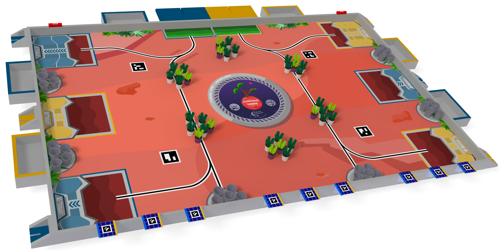

# ezBot

**ezBot** is the name of the future holonmic robot for ENSMASTEEL.

On this repository you will find 4 individual branches :

- `main`
- `electronic` where the KiCad project and librairies will reside
- `catia` for the cad files of our robot (CATIA V5-6R2018)
- `ezBot-ROS_ws` the ROS2 workspace folder for all of our ROS2 packages.

